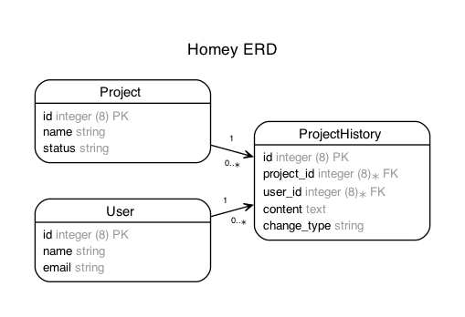
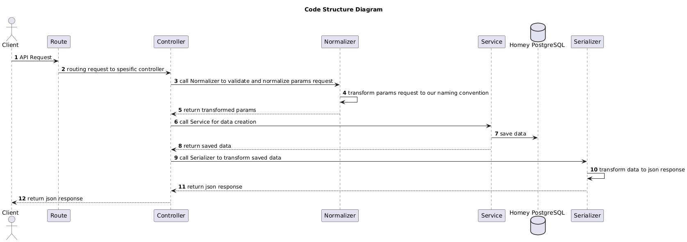
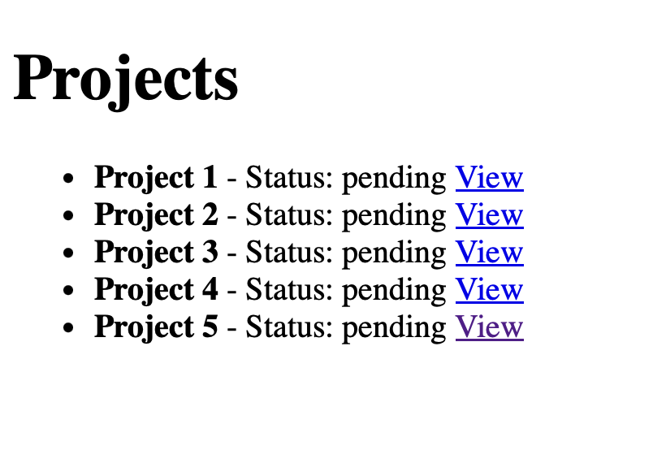
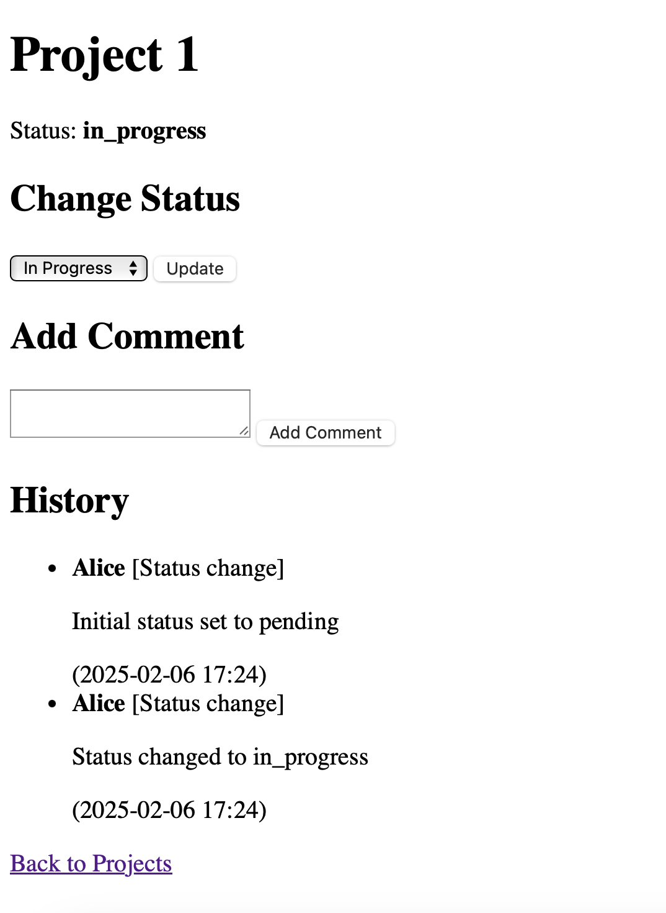

# Project Conversation History (Ruby on Rails)

This is a simple **Ruby on Rails** project that allows users to:
- Leave comments on a project.
- Change the status of a project.
- View the conversation history of a project.

## **Tech Stack**
- **Backend:** Ruby on Rails
- **Database:** PostgreSQL (via Docker Compose)
- **Frontend:** ERB (Embedded Ruby)

## **Setup Instructions**

### **1. Clone the Repository**
```bash
git clone <repository-url>
cd homey_project
```

### **2. Run Docker (PostgreSQL)**
```bash
docker-compose up -d
```

### **3. Install Dependencies**
```bash
bundle install
```

### **4. Setup Database**
```bash
cp env.sample .env
rails db:drop # ONLY if necessary
rails db:create
rails db:migrate
rails db:seed
rails erd # if you want to re-generate an Entity-Relationship Diagram (ERD)
```

### **5. Start the Rails Server**
```bash
rails s
```

Now, open **http://localhost:3000** in your browser to access the project.

---

## **Docker Compose for PostgreSQL**
The project uses Docker Compose to run PostgreSQL.

### **`docker-compose.yml`**
```yaml
version: '3.8'
services:
  db:
    image: postgres:15
    container_name: homey_postgres
    environment:
      POSTGRES_USER: postgres
      POSTGRES_PASSWORD: password
      POSTGRES_DB: homey_db
    ports:
      - "5432:5432"
    volumes:
      - postgres_data:/var/lib/postgresql/data

volumes:
  postgres_data:
```

---

## **Path Routes**
### **Projects List**
```http
GET /projects
```
### **View a Project**
```http
GET /projects/:id
```

---

## **Project Structure**
- `app/controllers/projects_controller.rb`: Handles project actions (list, update status, add comments).
- `app/models/project.rb`: Defines project model.
- `app/models/project_history.rb`: Defines project history model.
- `config/routes.rb`: Defines API endpoints.
- `app/views/projects/`: Contains ERB templates for the frontend.

## ERD


---

## **Sample Data (DB Seeds)**
The following sample projects are added when you run `rails db:seed`:
```ruby
Project.create!(name: "Homey App", status: "pending")
Project.create!(name: "E-Commerce API", status: "in_progress")
```

---

## **Notes**
- This is a simple version of the project.

- User authentication is hardcoded to use the first user in the database. In a real-world application, authentication would be implemented using JWT or OAuth.

- Ideally, the project structure would include:
  - **Normalizer**: To validate requests in the controller.
  - **Service Interface**: To encapsulate business logic.
  - **Serializer**: To format JSON responses properly.

### Ideal Code Structure Diagram



## **UI**

The UI for the project is simple and minimalistic, focusing on functionality over aesthetics. It uses basic HTML to display project information and actions.

### Project list view


### Projectdetail view



